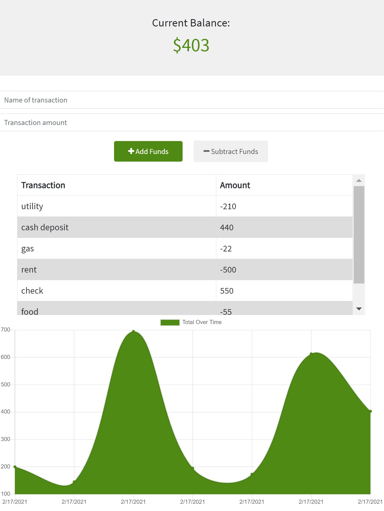

# Progressive-Budget
# by Merdad Karkudi
# project repository link : 
https://github.com/mkarkuody/Progressive-Budget

# Screenshots

# demo video link :
# as a user;
I want to be able to track my expenses to make sure I don't go over my budget also to be able to track my withdrawals and deposits.
Objective
Giving users a fast and easy way to track their money is important, but allowing them to access that information anytime is even more important.we as user sometimes do not have acces to internet and want to see our interaction without having internet. 

Technologies Used
Javascript
Node.js
Express
MongoDB
Mongoose
IndexedDB
# Credits:
Got help Online from : 
•	https://www.google.com/
•	www.YouTube.com 
•   Bootstrap 
•   MongoDB
•   Mangoose
•   Heroku 
 Thanks to John Young my class instructor and Ben Vaagen my TA. special Thanks to Abdul Aziz my TA and Amanda Crawford My Tutor for helping me to understand the class and homework contents.
# To create a Note Taker using this app;
Clone repository.
In the directory run npm install and then type npm start.
as soon as you see the Message,(App listening on PORT: 3000) you can work on your localhost and type on the save and retrieve the data.